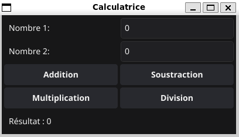
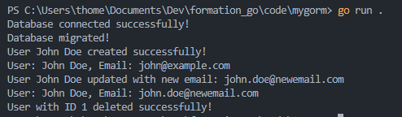

# Dépôt de code de la formation Go

Ce dépôt contient le code rédigé et fourni lors de la formation Go. Cette formation a pour objectif d'apprendre les bases du langage Go et ses cas d'usage. Celle-ci a eu lieu du 14 au 16 octobre 2024, dispensée par Paul Millet de l'organisme "LaMeDuSe".


## Architecture du dépôt

```
formation_go/
├── README.md
├── code/
│   ├── sujetX/
│   │   ├── packageX/
│   │   │   └── packageX.go
│   │   ├── go.mod
│   │   ├── (go.sum)
│   │   └── main.go
│   └── ...
└── supports/
    ├── gog_v1_fr--2-
    ├── pictureX.png
    └── ...
```

## Membre de la formation

- Cyril CANILLAS
- Edgar CROUS
- Julien FONTANEL
- Kaëlig LE MENER
- Khady DIOP
- Marwane AIT YACHOU
- Pierre AUFFRAY
- Thomas DELAPART
- Ugo OGER

## Tps

Version de Golang : 1.21.4

OS : WSL 2 [Ubuntu 22.04.5]

| TP     | Description                                              |
| ------ | -------------------------------------------------------- |
| TP1    | Hello World                                              |
| TP2    | Package avec fonctions de base mathématiques             |
| TP3    | Structures, méthodes et hérédité                         |
| TP4    | Utilisation des Goroutines                               |
| TP5    | Manipulation de fichiers                                 |
| TP6    | Calculatrice et tests (Bonus iterface graphique Fyne)    |



## POC grpc + protobuf

Le code du POC disponible dans le répertoire mygrpc implémente un client et un serveur simple communicant avec le protocol gRPC.

Protobuff définit une structure de données simple pour représenter un utilisateur.

Le serveur définit deux users protobuff en dur et expose une méthode GetUsers pour les récupérer.

Le client appelle cette méthode et récupère le user 1, il affiche alors Greeting + le nom de l'utilisateur.

### Compiler les protobuff

Il faut compiler les protobuff pour générer les fichiers go correspondants si on modifie le fichier mygrpc.proto ou si les fichiers go dans /src/protos_ext ne sont pas présents.

Pour cela, on définit deux varibles d'environnement et on lance la commande protoc.
```bash
export GO_MOD=bitbucket.org/lameduse/beforeafter-core-service

export PROTOBUF_DIR=./proto

protoc --experimental_allow_proto3_optional --go_out=src --go_opt=paths=source_relative --go_opt=Mprotos_ext/mygrpc.proto=$GO_MOD/protos_ext protos_ext/mygrpc.proto --go-grpc_out=src --go-grpc_opt=paths=source_relative --go-grpc_opt=Mprotos_ext/mygrpc.proto=$GO_MOD/protos_ext protos_ext/mygrpc.proto
```

### Lancer le serveur

```bash
go run mygrpc/server/server.go
```

Une fois le serveur lancé, il est possible de lancer le client, dans un autre terminal :

```bash
go run mygrpc/client/client.go
```

## POC Gorm

Prérequis :
- Avoir une base de données SQL (ici PostgreSQL) configurée avec les mêmes informations que le projet,
ici :
    - user: postgres
    - password: root
    - dbname: postgres
    - host: localhost (127.0.0.1)
    - port: 5432

On peut ensuite directement lancer le projet avec la commande :

```bash
cd mygorm
go run main.go
```

On pourra alors voir l'initialisation de la base de données, l'insertion de données, la récupération de données, la modification et la suppression de données.

